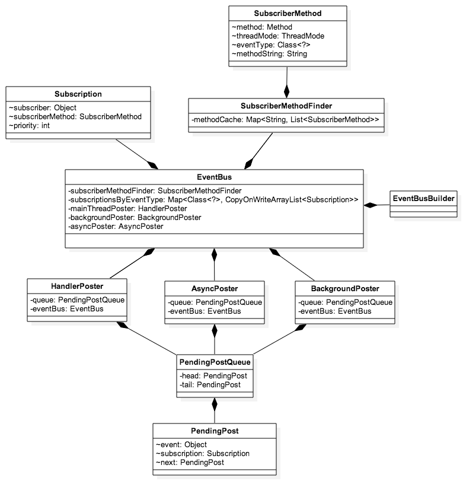

> 项目地址：[EventBus](https://github.com/greenrobot/EventBus)，本文分析版本: [513f466](https://github.com/greenrobot/EventBus/tree/513f466fee9eec849d4c6a900b7fc1bf6bdc8fba)

### 1.简介

想必每个入了门的Android开发者都多少对EventBus有过了解,EventBus是一个Android事件发布/订阅框架，通过解耦发布者和订阅者简化 Android 事件传递。EventBus使用简单,并将事件发布和订阅充分解耦,从而使代码更简洁。一直以来很受开发者的欢迎,截止到目前EventBus的安装量已经超过一亿次。足以看出EventBus有多么的优秀。

目前网上已经有不少优秀的EventBus的源码分析文章,我也一直在犹豫要不要再写一次,一方面是因为最近EventBus刚好更新了3.0版本,事件的订阅已经从方法名换成了注解的方式,而且整体还是有不少变化。另外一方面也是为了自己学习。毕竟写出来会有更深层次的理解。好了,下面让我们看看3.0版本EventBus的使用方法.

### 2.使用方法
#### 2.1注册订阅者
首先我们需要将我们希望订阅事件的类,通过EventBus类注册,注册代码如下:

```java
//3.0版本的注册
EventBus.getDefault().register(this);
	   
//2.x版本的注册
EventBus.getDefault().register(this);
EventBus.getDefault().register(this, 100);
EventBus.getDefault().registerSticky(this, 100);
EventBus.getDefault().registerSticky(this);
```


可以看到2.x版本中有四种注册方法,区分了普通注册和粘性事件注册,并且在注册时可以选择接收事件的优先级,这里我们就不对2.x版本做过多的研究了,如果想研究可以参照[此篇文章](http://kymjs.com/code/2015/12/12/01).由于3.0版本将粘性事件以及订阅事件的优先级换了一种更好的实现方式,所以3.0版本中的注册就变得简单,只有一个`register()`方法即可.

#### 2.2编写响应事件订阅方法
注册之后,我们需要编写响应事件的方法,代码如下:

```java
//3.0版本
@Subscribe(threadMode = ThreadMode.BACKGROUND, sticky = true, priority = 100)
public void test(String str) {
    
}

//2.x版本
public void onEvent(String str) {

}
public void onEventMainThread(String str) {

}
public void onEventBackgroundThread(String str) {

}
```


在2.x版本中只有通过onEvent开头的方法会被注册,而且响应事件方法触发的线程通过`onEventMainThread`或`onEventBackgroundThread`这些方法名区分,而在3.0版本中.通过`@Subscribe`注解,来确定运行的线程`threadMode`,是否接受粘性事件`sticky`以及事件优先级`priority`,而且方法名不在需要`onEvent`开头,所以又简洁灵活了不少.

#### 2.3发送事件
我们可以通过`EventBus`的`post()`方法来发送事件,发送之后就会执行注册过这个事件的对应类的方法.或者通过`postSticky()`来发送一个粘性事件.在代码是2.x版本和3.0版本是一样的.

```java
EventBus.getDefault().post("str");
EventBus.getDefault().postSticky("str");
```

#### 2.4解除注册
当我们不在需要接收事件的时候需要解除注册`unregister`,2.x和3.0的解除注册也是相同的.代码如下:
```java
EventBus.getDefault().unregister(this);
```

### 3.类关系图



类关系图我直接引用了[CodeKK的EventBus源代码分析](http://a.codekk.com/detail/Android/Trinea/EventBus%20%E6%BA%90%E7%A0%81%E8%A7%A3%E6%9E%90),
虽然更新了3.0,但是整体上的设计还是可以用上面的类图来分析,从类图上我们可以看到大部分类都是依赖于EventBus的,上部分主要是订阅者相关信息，中间是 EventBus 类，
下面是发布者发布事件后的调用。下面我们来进行源码分析.

### 4.源码分析

这一节我们通过`EventBus`的使用流程来分析它的调用流程,通过我们熟悉的使用方法来深入到`EventBus`的实现内部并理解它的实现原理.
#### 4.1创建EventBus
一般情况下我们都是通过`EventBus.getDefault()`获取到`EventBus`对象,从而在进行`register()`或者`post()`等等,所以我们看看`getDefault()`方法的实现:
```java
	public static EventBus getDefault() {
        if (defaultInstance == null) {
            synchronized (EventBus.class) {
                if (defaultInstance == null) {
                    defaultInstance = new EventBus();
                }
            }
        }
        return defaultInstance;
    }
```

这里就是设计模式里我们常用的**单例模式**了,目的是为了保证`getDefault()`得到的都是同一个实例。如果不存在实例,就调用了`EventBus`的构造方法:
```java
	private static final EventBusBuilder DEFAULT_BUILDER = new EventBusBuilder();
	
    public EventBus() {
        this(DEFAULT_BUILDER);
    }

    EventBus(EventBusBuilder builder) {
        //key:订阅的事件,value:订阅这个事件的所有订阅者集合
        //private final Map<Class<?>, CopyOnWriteArrayList<Subscription>> subscriptionsByEventType;
        subscriptionsByEventType = new HashMap<>();
        //key:订阅者对象,value:这个订阅者订阅的事件集合
        //private final Map<Object, List<Class<?>>> typesBySubscriber;
        typesBySubscriber = new HashMap<>();
        //粘性事件 key:粘性事件的class对象, value:事件对象
        //private final Map<Class<?>, Object> stickyEvents;
        stickyEvents = new ConcurrentHashMap<>();
        //事件主线程处理
        mainThreadPoster = new HandlerPoster(this, Looper.getMainLooper(), 10);
        //事件 Background 处理
        backgroundPoster = new BackgroundPoster(this);
        //事件异步线程处理
        asyncPoster = new AsyncPoster(this);
        indexCount = builder.subscriberInfoIndexes != null ? builder.subscriberInfoIndexes.size() : 0;
        //订阅者响应函数信息存储和查找类
        subscriberMethodFinder = new SubscriberMethodFinder(builder.subscriberInfoIndexes,
                builder.strictMethodVerification, builder.ignoreGeneratedIndex);
        logSubscriberExceptions = builder.logSubscriberExceptions;
        logNoSubscriberMessages = builder.logNoSubscriberMessages;
        sendSubscriberExceptionEvent = builder.sendSubscriberExceptionEvent;
        sendNoSubscriberEvent = builder.sendNoSubscriberEvent;
        throwSubscriberException = builder.throwSubscriberException;
        //是否支持事件继承
        eventInheritance = builder.eventInheritance;
        executorService = builder.executorService;
    }
```

可以看出是通过初始化了一个`EventBusBuilder()`对象来分别初始化`EventBus`的一些配置,当我们在写一个需要自定义配置的框架的时候,这种实现方法非常普遍,将配置解耦出去,使我们的代码结构更清晰.注释里我标注了大部分比较重要的对象,这里没必要记住,看下面的文章时如果对某个对象不了解,可以再回来看看.

#### 4.2注册过程源码分析

##### 4.2.1 register()方法的实现

3.0的注册只提供一个`register()`方法了,所以我们先来看看`register()`方法做了什么:
```java
    public void register(Object subscriber) {
        //首先获得订阅者的class对象
        Class<?> subscriberClass = subscriber.getClass();
        //通过subscriberMethodFinder来找到订阅者订阅了哪些事件.返回一个SubscriberMethod对象的List,SubscriberMethod
        //里包含了这个方法的Method对象,以及将来响应订阅是在哪个线程的ThreadMode,以及订阅的事件类型eventType,以及订阅的优
        //先级priority,以及是否接收粘性sticky事件的boolean值.
        List<SubscriberMethod> subscriberMethods = subscriberMethodFinder.findSubscriberMethods(subscriberClass);
        synchronized (this) {
            for (SubscriberMethod subscriberMethod : subscriberMethods) {
                //订阅
                subscribe(subscriber, subscriberMethod);
            }
        }
    }
```

可以看到`register()`方法很简洁,代码里的注释也很清楚了,我们可以看出通过`subscriberMethodFinder.findSubscriberMethods(subscriberClass)`方法就能返回一个`SubscriberMethod`的对象,而`SubscriberMethod`里包含了所有我们需要的接下来执行`subscribe()`的信息.所以我们先去看看`findSubscriberMethods()`是怎么实现的,然后我们再去关注`subscribe()`。

##### 4.2.2 SubscriberMethodFinder的实现

一句话来描述`SubscriberMethodFinder`类就是用来查找和缓存订阅者响应函数的信息的类。所以我们首先要知道怎么能获得订阅者响应函数的相关信息。在3.0版本中,`EventBus`提供了一个`EventBusAnnotationProcessor`注解处理器来在编译期通过读取`@Subscribe()`注解并解析,处理其中所包含的信息,然后生成`java`类来保存所有订阅者关于订阅的信息,这样就比在运行时使用反射来获得这些订阅者的信息速度要快.我们可以参考`EventBus`项目里的[EventBusPerformance](https://github.com/greenrobot/EventBus/tree/master/EventBusPerformance)这个例子,编译后我们可以在`build`文件夹里找到这个类,[MyEventBusIndex](https://github.com/greenrobot/EventBus/blob/master/EventBusPerformance/build.gradle#L27) 类,当然类名是可以自定义的.我们大致看一下生成的`MyEventBusIndex`类是什么样的:

```java
/**
 * This class is generated by EventBus, do not edit.
 */
public class MyEventBusIndex implements SubscriberInfoIndex {
    private static final Map<Class<?>, SubscriberInfo> SUBSCRIBER_INDEX;

    static {
        SUBSCRIBER_INDEX = new HashMap<Class<?>, SubscriberInfo>();

        putIndex(new SimpleSubscriberInfo(org.greenrobot.eventbusperf.testsubject.PerfTestEventBus.SubscriberClassEventBusAsync.class,
                true, new SubscriberMethodInfo[]{
                new SubscriberMethodInfo("onEventAsync", TestEvent.class, ThreadMode.ASYNC),
        }));

        putIndex(new SimpleSubscriberInfo(TestRunnerActivity.class, true, new SubscriberMethodInfo[]{
                new SubscriberMethodInfo("onEventMainThread", TestFinishedEvent.class, ThreadMode.MAIN),
        }));
    }

    private static void putIndex(SubscriberInfo info) {
        SUBSCRIBER_INDEX.put(info.getSubscriberClass(), info);
    }

    @Override
    public SubscriberInfo getSubscriberInfo(Class<?> subscriberClass) {
        SubscriberInfo info = SUBSCRIBER_INDEX.get(subscriberClass);
        if (info != null) {
            return info;
        } else {
            return null;
        }
    }
}
```

可以看出是使用一个静态`HashMap`即:`SUBSCRIBER_INDEX`来保存订阅类的信息,其中包括了订阅类的class对象,是否需要检查父类,以及订阅方法的信息`SubscriberMethodInfo`的数组,`SubscriberMethodInfo`中又保存了,订阅方法的方法名,订阅的事件类型,触发线程,是否接收sticky事件以及优先级priority.这其中就保存了`register()`的所有需要的信息,如果再配置`EventBus`的时候通过`EventBusBuilder`配置:`eventBus = EventBus.builder().addIndex(new MyEventBusIndex()).build();`来将编译生成的`MyEventBusIndex`配置进去,这样就能在`SubscriberMethodFinder`类中直接查找出订阅类的信息,就不需要再利用注解判断了,当然这种方法是作为`EventBus`的可选配置,`SubscriberMethodFinder`同样提供了通过注解来获得订阅类信息的方法,下面我们就来看`findSubscriberMethods()`到底是如何实现的:

```java
    List<SubscriberMethod> findSubscriberMethods(Class<?> subscriberClass) {
        //先从METHOD_CACHE取看是否有缓存,key:保存订阅类的类名,value:保存类中订阅的方法数据,
        List<SubscriberMethod> subscriberMethods = METHOD_CACHE.get(subscriberClass);
        if (subscriberMethods != null) {
            return subscriberMethods;
        }
        //是否忽略注解器生成的MyEventBusIndex类
        if (ignoreGeneratedIndex) {
            //利用反射来读取订阅类中的订阅方法信息
            subscriberMethods = findUsingReflection(subscriberClass);
        } else {
            //从注解器生成的MyEventBusIndex类中获得订阅类的订阅方法信息
            subscriberMethods = findUsingInfo(subscriberClass);
        }
        if (subscriberMethods.isEmpty()) {
            throw new EventBusException("Subscriber " + subscriberClass
                    + " and its super classes have no public methods with the @Subscribe annotation");
        } else {
            //保存进METHOD_CACHE缓存
            METHOD_CACHE.put(subscriberClass, subscriberMethods);
            return subscriberMethods;
        }
    }
```

注释很详细我们就不在多说,由于篇幅原因我们就不在分析`findUsingInfo()`方法,其无非就是通过查找我们上面所说的`MyEventBusIndex`类中的信息,来转换成`List<SubscriberMethod>`从而获得订阅类的相关订阅函数的各种信息.有兴趣的可以自己研究看看,下面我们就来看`findUsingReflection()`方法是如何实现的:
```java
    private List<SubscriberMethod> findUsingReflection(Class<?> subscriberClass) {
        //FindState 用来做订阅方法的校验和保存
        FindState findState = prepareFindState();
        findState.initForSubscriber(subscriberClass);
        while (findState.clazz != null) {
            //通过反射来获得订阅方法信息
            findUsingReflectionInSingleClass(findState);
            //查找父类的订阅方法
            findState.moveToSuperclass();
        }
        //获取findState中的SubscriberMethod(也就是订阅方法List)并返回
        return getMethodsAndRelease(findState);
    }
```

这里通过`FindState`类来做订阅方法的校验和保存,并通过`FIND_STATE_POOL`静态数组来保存`FindState`对象,可以使`FindState`复用,避免重复创建过多的对象.最终是通过`findUsingReflectionInSingleClass()`来具体获得相关订阅方法的信息的:

```java
    private void findUsingReflectionInSingleClass(FindState findState) {
        Method[] methods;
        //通过反射得到方法数组
        try {
            // This is faster than getMethods, especially when subscribers are fat classes like Activities
            methods = findState.clazz.getDeclaredMethods();
        } catch (Throwable th) {
            // Workaround for java.lang.NoClassDefFoundError, see https://github.com/greenrobot/EventBus/issues/149
            methods = findState.clazz.getMethods();
            findState.skipSuperClasses = true;
        }
        //遍历Method
        for (Method method : methods) {
            int modifiers = method.getModifiers();
            if ((modifiers & Modifier.PUBLIC) != 0 && (modifiers & MODIFIERS_IGNORE) == 0) {
                Class<?>[] parameterTypes = method.getParameterTypes();
                //保证必须只有一个事件参数
                if (parameterTypes.length == 1) {
                    //得到注解
                    Subscribe subscribeAnnotation = method.getAnnotation(Subscribe.class);
                    if (subscribeAnnotation != null) {
                        Class<?> eventType = parameterTypes[0];
                        //校验是否添加该方法
                        if (findState.checkAdd(method, eventType)) {
                            ThreadMode threadMode = subscribeAnnotation.threadMode();
                            //实例化SubscriberMethod对象并添加
                            findState.subscriberMethods.add(new SubscriberMethod(method, eventType, threadMode,
                                    subscribeAnnotation.priority(), subscribeAnnotation.sticky()));
                        }
                    }
                } else if (strictMethodVerification && method.isAnnotationPresent(Subscribe.class)) {
                    String methodName = method.getDeclaringClass().getName() + "." + method.getName();
                    throw new EventBusException("@Subscribe method " + methodName +
                            "must have exactly 1 parameter but has " + parameterTypes.length);
                }
            } else if (strictMethodVerification && method.isAnnotationPresent(Subscribe.class)) {
                String methodName = method.getDeclaringClass().getName() + "." + method.getName();
                throw new EventBusException(methodName +
                        " is a illegal @Subscribe method: must be public, non-static, and non-abstract");
            }
        }
    }
```

这里走完,我们订阅类的所有`SubscriberMethod`都已经被保存了,最后再通过`getMethodsAndRelease()`返回`List<SubscriberMethod>`至此,所有关于如何获得订阅类的订阅方法信息即:`SubscriberMethod`对象就已经完全分析完了,下面我们来看`subscribe()`是如何实现的.

##### 4.2.3 subscribe()方法的实现

好的,这里我们回到4.2.1的`subscribe(subscriber, subscriberMethod);`中去,通过这个方法,我们就完成了注册,下面看一下`subscribe()`的实现:
```java
    //必须在同步代码块里调用
    private void subscribe(Object subscriber, SubscriberMethod subscriberMethod) {
        //获取订阅的事件类型
        Class<?> eventType = subscriberMethod.eventType;
        //创建Subscription对象
        Subscription newSubscription = new Subscription(subscriber, subscriberMethod);
        //从subscriptionsByEventType里检查是否已经添加过该Subscription,如果添加过就抛出异常
        CopyOnWriteArrayList<Subscription> subscriptions = subscriptionsByEventType.get(eventType);
        if (subscriptions == null) {
            subscriptions = new CopyOnWriteArrayList<>();
            subscriptionsByEventType.put(eventType, subscriptions);
        } else {
            if (subscriptions.contains(newSubscription)) {
                throw new EventBusException("Subscriber " + subscriber.getClass() + " already registered to event "
                        + eventType);
            }
        }
        //根据优先级priority来添加Subscription对象
        int size = subscriptions.size();
        for (int i = 0; i <= size; i++) {
            if (i == size || subscriberMethod.priority > subscriptions.get(i).subscriberMethod.priority) {
                subscriptions.add(i, newSubscription);
                break;
            }
        }
        //将订阅者对象以及订阅的事件保存到typesBySubscriber里.
        List<Class<?>> subscribedEvents = typesBySubscriber.get(subscriber);
        if (subscribedEvents == null) {
            subscribedEvents = new ArrayList<>();
            typesBySubscriber.put(subscriber, subscribedEvents);
        }
        subscribedEvents.add(eventType);
        //如果接收sticky事件,立即分发sticky事件
        if (subscriberMethod.sticky) {
            //eventInheritance 表示是否分发订阅了响应事件类父类事件的方法
            if (eventInheritance) {
                // Existing sticky events of all subclasses of eventType have to be considered.
                // Note: Iterating over all events may be inefficient with lots of sticky events,
                // thus data structure should be changed to allow a more efficient lookup
                // (e.g. an additional map storing sub classes of super classes: Class -> List<Class>).
                Set<Map.Entry<Class<?>, Object>> entries = stickyEvents.entrySet();
                for (Map.Entry<Class<?>, Object> entry : entries) {
                    Class<?> candidateEventType = entry.getKey();
                    if (eventType.isAssignableFrom(candidateEventType)) {
                        Object stickyEvent = entry.getValue();
                        checkPostStickyEventToSubscription(newSubscription, stickyEvent);
                    }
                }
            } else {
                Object stickyEvent = stickyEvents.get(eventType);
                checkPostStickyEventToSubscription(newSubscription, stickyEvent);
            }
        }
    }
```
以上就是所有注册过程,现在再来看这张图就会特别清晰`EventBus`的`register()`过程了:


#### 4.3事件分发过程源码分析

通过第二节我们知道可以通过`EventBus.getDefault().post("str");`来发送一个事件,所以我们就从这行代码开始分析,首先看看`post()`方法是如何实现的:

```java
    public void post(Object event) {
        //得到当前线程的Posting状态.
        PostingThreadState postingState = currentPostingThreadState.get();
        //获取当前线程的事件队列
        List<Object> eventQueue = postingState.eventQueue;
        eventQueue.add(event);

        if (!postingState.isPosting) {
            postingState.isMainThread = Looper.getMainLooper() == Looper.myLooper();
            postingState.isPosting = true;
            if (postingState.canceled) {
                throw new EventBusException("Internal error. Abort state was not reset");
            }
            try {
                //一直发送
                while (!eventQueue.isEmpty()) {
                    //发送单个事件
                    postSingleEvent(eventQueue.remove(0), postingState);
                }
            } finally {
                postingState.isPosting = false;
                postingState.isMainThread = false;
            }
        }
    }
```

首先是通过`currentPostingThreadState.get()`方法来得到当前线程`PostingThreadState`的对象,为什么是说当前线程我们来看看`currentPostingThreadState`的实现:

```java
    private final ThreadLocal<PostingThreadState> currentPostingThreadState = new ThreadLocal<PostingThreadState>() {
        @Override
        protected PostingThreadState initialValue() {
            return new PostingThreadState();
        }
    };

```

`currentPostingThreadState`的实现是一个包含了`PostingThreadState`的`ThreadLocal`对象,关于`ThreadLocal`
[张涛的这篇文章解释的很好](http://kymjs.com/code/2015/12/16/01):ThreadLocal 是一个线程内部的数据存储类，通过它可以在指定的线程中存储数据，
而这段数据是不会与其他线程共享的。其内部原理是通过生成一个它包裹的泛型对象的数组，在不同的线程会有不同的数组索引值，通过这样就可以做到每个线程通过 
get() 方法获取的时候，取到的只能是自己线程所对应的数据。 所以这里取到的就是每个线程的`PostingThreadState`状态.接下来我们来看`postSingleEvent()`
方法:

```java
    private void postSingleEvent(Object event, PostingThreadState postingState) throws Error {
        Class<?> eventClass = event.getClass();
        boolean subscriptionFound = false;
        //是否触发订阅了该事件(eventClass)的父类,以及接口的类的响应方法.
        if (eventInheritance) {
            //查找eventClass类所有的父类以及接口
            List<Class<?>> eventTypes = lookupAllEventTypes(eventClass);
            int countTypes = eventTypes.size();
            //循环postSingleEventForEventType
            for (int h = 0; h < countTypes; h++) {
                Class<?> clazz = eventTypes.get(h);
                //只要右边有一个为true,subscriptionFound就为true
                subscriptionFound |= postSingleEventForEventType(event, postingState, clazz);
            }
        } else {
            //post单个
            subscriptionFound = postSingleEventForEventType(event, postingState, eventClass);
        }
        //如果没发现
        if (!subscriptionFound) {
            if (logNoSubscriberMessages) {
                Log.d(TAG, "No subscribers registered for event " + eventClass);
            }
            if (sendNoSubscriberEvent && eventClass != NoSubscriberEvent.class &&
                    eventClass != SubscriberExceptionEvent.class) {
                //发送一个NoSubscriberEvent事件,如果我们需要处理这种状态,接收这个事件就可以了
                post(new NoSubscriberEvent(this, event));
            }
        }
    }
```
跟着上面的代码的注释,我们可以很清楚的发现是在`postSingleEventForEventType()`方法里去进行事件的分发,代码如下:

```java
    private boolean postSingleEventForEventType(Object event, PostingThreadState postingState, Class<?> eventClass) {
        CopyOnWriteArrayList<Subscription> subscriptions;
        //获取订阅了这个事件的Subscription列表.
        synchronized (this) {
            subscriptions = subscriptionsByEventType.get(eventClass);
        }
        if (subscriptions != null && !subscriptions.isEmpty()) {
            for (Subscription subscription : subscriptions) {
                postingState.event = event;
                postingState.subscription = subscription;
                //是否被中断
                boolean aborted = false;
                try {
                    //分发给订阅者
                    postToSubscription(subscription, event, postingState.isMainThread);
                    aborted = postingState.canceled;
                } finally {
                    postingState.event = null;
                    postingState.subscription = null;
                    postingState.canceled = false;
                }
                if (aborted) {
                    break;
                }
            }
            return true;
        }
        return false;
    }

    private void postToSubscription(Subscription subscription, Object event, boolean isMainThread) {
        switch (subscription.subscriberMethod.threadMode) {
            case POSTING:
                invokeSubscriber(subscription, event);
                break;
            case MAIN:
                if (isMainThread) {
                    invokeSubscriber(subscription, event);
                } else {
                    mainThreadPoster.enqueue(subscription, event);
                }
                break;
            case BACKGROUND:
                if (isMainThread) {
                    backgroundPoster.enqueue(subscription, event);
                } else {
                    invokeSubscriber(subscription, event);
                }
                break;
            case ASYNC:
                asyncPoster.enqueue(subscription, event);
                break;
            default:
                throw new IllegalStateException("Unknown thread mode: " + subscription.subscriberMethod.threadMode);
        }
    }
```

总结上面的代码就是,首先从`subscriptionsByEventType`里获得所有订阅了这个事件的`Subscription`列表,然后在通过`postToSubscription()`方法来分发
事件,在`postToSubscription()`通过不同的`threadMode`在不同的线程里`invoke()`订阅者的方法,`ThreadMode`共有四类:
1. `PostThread`：默认的 ThreadMode，表示在执行 Post 操作的线程直接调用订阅者的事件响应方法，不论该线程是否为主线程（UI 线程）。当该线程为主线程时，响应方法中不能有耗时操作，否则有卡主线程的风险。适用场景：**对于是否在主线程执行无要求，但若 Post 线程为主线程，不能耗时的操作**；  
2. `MainThread`：在主线程中执行响应方法。如果发布线程就是主线程，则直接调用订阅者的事件响应方法，否则通过主线程的 Handler 发送消息在主线程中处理——调用订阅者的事件响应函数。显然，`MainThread`类的方法也不能有耗时操作，以避免卡主线程。适用场景：**必须在主线程执行的操作**；  
3. `BackgroundThread`：在后台线程中执行响应方法。如果发布线程**不是**主线程，则直接调用订阅者的事件响应函数，否则启动**唯一的**后台线程去处理。由于后台线程是唯一的，当事件超过一个的时候，它们会被放在队列中依次执行，因此该类响应方法虽然没有`PostThread`类和`MainThread`类方法对性能敏感，但最好不要有重度耗时的操作或太频繁的轻度耗时操作，以造成其他操作等待。适用场景：*操作轻微耗时且不会过于频繁*，即一般的耗时操作都可以放在这里；  
4. `Async`：不论发布线程是否为主线程，都使用一个空闲线程来处理。和`BackgroundThread`不同的是，`Async`类的所有线程是相互独立的，因此不会出现卡线程的问题。适用场景：*长耗时操作，例如网络访问*。  
[引用自](http://a.codekk.com/detail/Android/Trinea/EventBus%20%E6%BA%90%E7%A0%81%E8%A7%A3%E6%9E%90)

这里我们只来看看`invokeSubscriber(subscription, event);`是如何实现的,关于不同线程的`Poster`的使用可以参考[这篇文章](http://kymjs.com/code/2015/12/12/01)
以及上面codekk的文章.`invokeSubscriber(subscription, event);`代码如下:

```java
    void invokeSubscriber(Subscription subscription, Object event) {
        try {
            subscription.subscriberMethod.method.invoke(subscription.subscriber, event);
        } catch (InvocationTargetException e) {
            handleSubscriberException(subscription, event, e.getCause());
        } catch (IllegalAccessException e) {
            throw new IllegalStateException("Unexpected exception", e);
        }
    }
```
实际上就是通过反射调用了订阅者的订阅函数并把`event`对象作为参数传入.至此`post()`流程就结束了,整体流程图如下:


#### 4.4解除注册源码分析
看完了上面的分析,解除注册就相对容易了,解除注册只要调用`unregister()`方法即可,实现如下:
```java
    public synchronized void unregister(Object subscriber) {
        //通过typesBySubscriber来取出这个subscriber订阅者订阅的事件类型,
        List<Class<?>> subscribedTypes = typesBySubscriber.get(subscriber);
        if (subscribedTypes != null) {
            //分别解除每个订阅了的事件类型
            for (Class<?> eventType : subscribedTypes) {
                unsubscribeByEventType(subscriber, eventType);
            }
            //从typesBySubscriber移除subscriber
            typesBySubscriber.remove(subscriber);
        } else {
            Log.w(TAG, "Subscriber to unregister was not registered before: " + subscriber.getClass());
        }
    }
```

然后接着看`unsubscribeByEventType()`方法的实现:
```java
    private void unsubscribeByEventType(Object subscriber, Class<?> eventType) {
        //subscriptionsByEventType里拿出这个事件类型的订阅者列表.
        List<Subscription> subscriptions = subscriptionsByEventType.get(eventType);
        if (subscriptions != null) {
            int size = subscriptions.size();
            //取消订阅
            for (int i = 0; i < size; i++) {
                Subscription subscription = subscriptions.get(i);
                if (subscription.subscriber == subscriber) {
                    subscription.active = false;
                    subscriptions.remove(i);
                    i--;
                    size--;
                }
            }
        }
    }
```

最终分别从`typesBySubscriber`和`subscriptions`里分别移除订阅者以及相关信息即可.

### 5.设计模式
#### 观察者模式
[观察者模式](http://www.cnblogs.com/java-my-life/archive/2012/05/16/2502279.html)观察者模式是对象的行为模式，又叫发布-订阅(Publish/Subscribe)模式、模型-视图(Model/View)模式、源-监听器(Source/Listener)模式或从属者(Dependents)模式。观察者模式定义了一种一对多的依赖关系，让多个观察者对象同时监听某一个主题对象。这个主题对象在状态上发生变化时，会通知所有观察者对象，使它们能够自动更新自己。`EventBus`并不是标准的观察者模式的实现,但是它的整体就是一个发布/订阅框架,也拥有观察者模式的优点,比如:发布者和订阅者的解耦.

### 6.个人评价
`EventBus`不论从使用方式和实现方式上都是非常值得我们学习的开源项目,我参与的一些项目里都是广泛的使用`EventBus`做消息的通知,可以说是目前消息通知里最好用
的项目.但是业内对`EventBus`的主要争论点是在于`EventBus`使用反射会出现性能问题,关于反射的性能问题可以参考[这篇文章](http://www.cnblogs.com/zhishan/p/3195771.html),
实际上在`EventBus`里我们可以看到不仅可以使用注解处理器预处理获取订阅信息,`EventBus`也会将订阅者的方法缓存到`METHOD_CACHE`里避免重复查找,所以只有在最后
`invoke()`方法的时候会比直接调用多出一些性能损耗,但是这些对于我们移动端来说是完全可以忽略的.所以盲目的说因为性能问题而觉得`EventBus`不值得使用显然是不
负责任的.在2.x版本里`EventBus`写出的代码可读性不是太好因为所有订阅方法都是`onEvent`开头,这样就使代码的可读性降低不少,但是3.0之后我们就不用担心这些了,因为
方法名已经不再需要`onEvent`开头了。所以总体上来说`EventBus`还是值得我们在项目中使用的。

